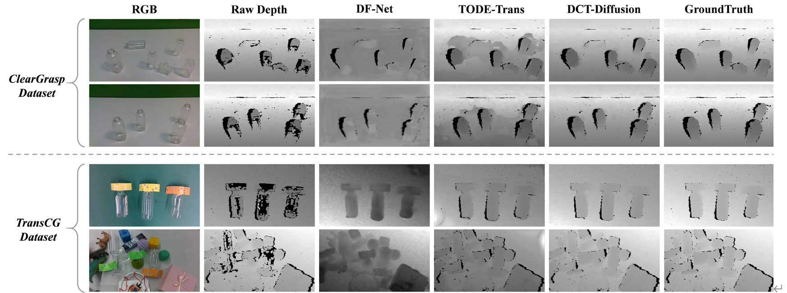
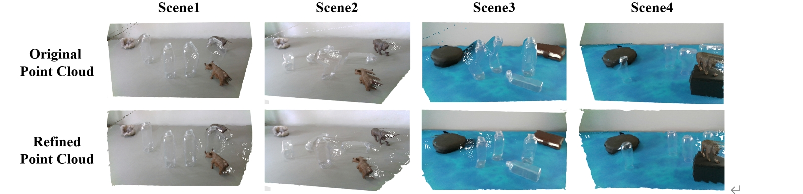

# DCT-Diffusion: Depth Completion for Transparent Objects with Diffusion Denoising Approach

PyTorch implementation of paper "DCT-Diffusion: Depth Completion for Transparent Objects with Diffusion Denoising Approach"

## Discription
This repository provides the code for our model, which partially references [TODE](https://github.com/yuchendoudou/TODE) and [DiffusionDepth](https://github.com/duanyiqun/DiffusionDepth). We provide visualization results of the depth maps generated by different methods for comparison.

## Dataset Preparation

### ClearGrasp Dataset

You can download the ClearGrasp dataset (including both training and testing datasets) from the [official website](https://sites.google.com/view/cleargrasp/data). After downloading and extracting the zip files, the folder structure should look like this:

```
${DATASET_ROOT_DIR}
├── cleargrasp
│   ├── cleargrasp-dataset-train
│   ├── cleargrasp-dataset-test-val
```

### Omniverse Object Dataset

The Omniverse Object Dataset can be downloaded from [this link](https://drive.google.com/drive/folders/1wCB1vZ1F3up5FY5qPjhcfSfgXpAtn31H?usp=sharing). After downloading and extracting the zip files, the folder structure will be:

```
${DATASET_ROOT_DIR}
├── omniverse
│   ├── train
│   │    ├── 20200904
│   │    ├── 20200910
```

## TransCG Dataset

The TransCG dataset can be downloaded from [here](https://graspnet.net/transcg). After downloading and extracting the zip files, the folder structure will be as follows:

```
${DATASET_ROOT_DIR}
├── transcg
│   ├── data
│   │    ├── scene1
│   │    |      ├── 0
|   |    |      |   ├── corrected_pose
|   |    |      |   ├── depth1.png 
|   |    |      |   ├── depth1-gt.png
|   |    |      |   ├── depth1-gt-mask.png
|   |    |      |   ├── depth1-gt-sn.png
```

## Requirements

The code has been tested under

- Ubuntu 20.04 + NVIDIA GeForce RTX 3090
- PyTorch 1.11.0

    System dependencies can be installed by:

```shell
sudo apt-get install libhdf5-10 libhdf5-serial-dev libhdf5-dev libhdf5-cpp-11sudo apt install libopenexr-dev zlib1g-dev openexr
```

Other dependencies can be installed by

```shell
pip install -r requirements.txt
```

## Training

To train the model from scratch, you need to specify the appropriate configuration file that matches your training and validation setup. Below are the training commands for different scenarios:

```
#Train on transcg dataset and test on transcg
python train.py -c ./configs/train_transcg_val_transcg.yaml

#Tran on CGsyn+ood and test on CGreal
python train.py -c ./configs/train_cgsyn+ood_val_cgreal.yaml
#Tran on CGsyn+ood and test on Transcg
python train.py -c ./configs/train_cgsyn+ood_val_transcg.yaml
```

Make sure that the dataset paths and hyperparameters are correctly set in the configuration files before starting the training. If you want to resume training from a checkpoint, specify the checkpoint path in the configuration file under the `checkpoint_path` field.

## Model Results Visualization

The following images show the visualization results of the depth maps generated by various methods across different scenes from ClearGrasp and TransCG datasets. As illustrated, the raw depth map contains many “black holes”, which denote the regions that the camera can not acquire reliable depth information. The depth maps generated by previous methods have blurred edges, while our DCT-Diffusion can consistently generate depth maps with more complete geometry and clearer boundaries, especially around glass edges and reflective surfaces.



This figure presents the reconstructed point clouds from the depth and RGB images in different scenes. The first row displays 3D point clouds generated from the original depth data using interpolation processing, while the second row illustrates the 3D point clouds reconstructed from the refined depth map through our proposed method. Compared to the original point clouds, our method achieves high-quality depth completion and further generate more accurate and complete point cloud results.


